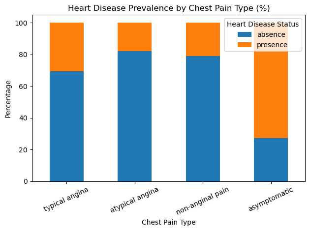

# Heart Disease Analysis 🫀
**Applied Data Science with Python – Codecademy Bootcamp Contest**

This project analyzes clinical and demographic factors associated with heart disease using data from patients evaluated at the Cleveland Clinic Foundation. The goal is to identify meaningful relationships between medical indicators and heart disease outcomes through statistical testing and visual storytelling.

---

## 🔍 Project Highlights
- End-to-end statistical analysis using real clinical data (303 patients)
- Applied hypothesis testing, including:
  - One-sample & independent t-tests
  - ANOVA with Bonferroni correction
  - Chi-square tests for categorical predictors
- Clear, publication-style visualizations for medical interpretability
- Focus on explainability rather than black-box prediction
- Includes presentation slides and a visual poster for non-technical audiences

---

## 📊 Dataset
The dataset was sourced from the UCI Machine Learning Repository and includes information such as:
- Age and sex  
- Resting blood pressure  
- Serum cholesterol  
- Chest pain type  
- Exercise-induced angina  
- Fasting blood sugar  
- Maximum heart rate during exercise  
- Heart disease diagnosis (presence / absence)

---

## 🔬 Analysis Overview

### Part I – Cholesterol & Fasting Blood Sugar
- One-sample t-tests evaluated whether average cholesterol levels exceed clinical risk thresholds.
- A binomial hypothesis test assessed whether the prevalence of high fasting blood sugar (>120 mg/dl) exceeded population-level estimates.

### Part II – Predictors of Heart Disease
- Independent t-tests compared maximum heart rate (thalach) and age between patients with and without heart disease.
- ANOVA and post-hoc tests examined differences in maximum heart rate across chest pain types.
- Chi-square tests evaluated associations between heart disease and categorical variables such as chest pain type, exercise-induced angina, and sex.

---

## 📈 Key Findings
- Patients with heart disease exhibit significantly lower maximum heart rates during exercise.
- Age is significantly associated with heart disease, with affected patients generally being older.
- Chest pain type is strongly linked to heart disease outcomes, with asymptomatic patients showing the highest prevalence.
- Exercise-induced angina is a strong indicator of heart disease risk.
- Elevated cholesterol and high fasting blood sugar are significantly more common in patients with heart disease.

---

## 📊 Sample Visualization

---

## 🛠 Tools & Libraries
- Python  
- Pandas  
- NumPy  
- SciPy  
- Matplotlib  
- Seaborn  
- Jupyter Notebook (VS Code)

---

## ✨ Conclusion
This project demonstrates how statistical hypothesis testing combined with effective visualization can uncover meaningful clinical insights. The results highlight the importance of integrating exercise test performance, symptom presentation, and metabolic indicators when assessing heart disease risk.

---

## 📌 Author
**Maria Kourkoulou**  
Applied Data Science with Python – Codecademy Bootcamp

